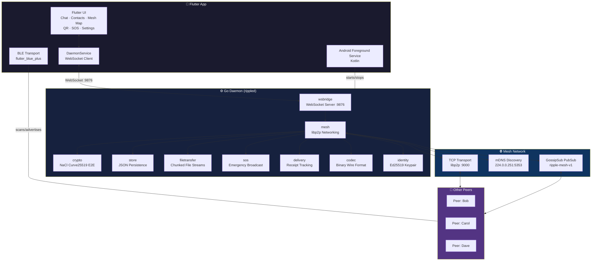
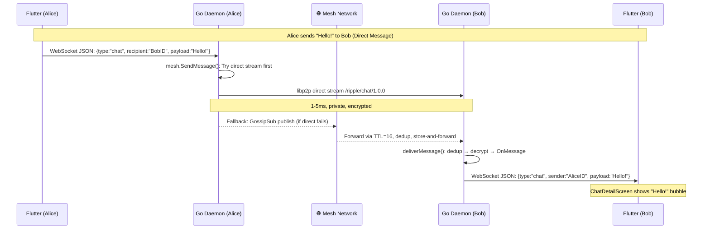
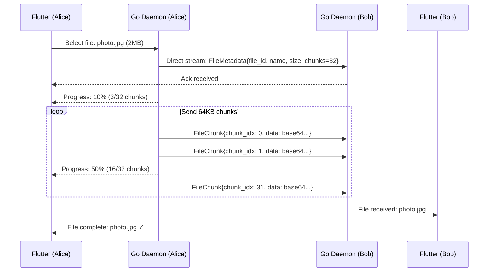

# 🌊 Ripple — Offline Mesh Messenger

**Ripple** is a peer-to-peer messaging app that works without internet, cellular towers, or any central infrastructure. Messages ripple outward through nearby devices, creating a mesh network that grows with every peer.

```
Messages travel device → device → device
No internet. No SIM. No servers.
Your phone becomes a relay for the community.
```

---

## 🚀 Quick Start

### Prerequisites
- Go 1.21+ (for the daemon)
- A laptop with WiFi (for local testing)
- Flutter 3.16+ (for the mobile app)

### Run the Go Daemon (CLI)

```bash
# Clone and build
git clone https://github.com/shashank-tomar0/Ripple.git
cd Ripple/go-daemon
go build -o ripple ./cmd/rippled

# Start a node
./rippled -nick alice

# On another machine (or another terminal)
./rippled -nick bob -port 9001
```

Once both are running on the same WiFi network, mDNS automatically discovers peers. Type a message and press Enter — it broadcasts to all connected peers.

### CLI Commands

| Command | Description |
|---|---|
| `/help` | Show all commands |
| `/me` | Show your PeerID and nickname |
| `/peers` | List connected peers |
| `/msg <short-id> <text>` | Send a direct message |
| `/addrs` | Show your multiaddresses |
| `/connect <addr>` | Connect to a specific peer |
| `/nick <name>` | Change your display name |
| `/stats` | Show mesh statistics |
| `/quit` | Exit |

### CLI Flags

| Flag | Default | Description |
|---|---|---|
| `--port` | `9000` | TCP listen port for libp2p |
| `--wsport` | `9876` | WebSocket port for Flutter bridge |
| `--nick` | `peer` | Display nickname |
| `--db` | `~/.ripple/ripple.db` | Persistent store path (JSON backup) |
| `--peers` | `` | Comma-separated bootstrap peer multiaddrs |
| `--debug` | `false` | Enable debug logging |

---

## 🏗️ Architecture

### System Architecture



### Data Flow — Message Journey (Alice → Bob)



### Data Flow — File Transfer



### Components

| Component | Tech | Purpose |
|---|---|---|
| **Flutter App** | Flutter 3.16 + Dart | Cross-platform UI (chat, contacts, mesh map, QR, files, SOS) |
| **Go Daemon** | Go 1.21 + libp2p | Mesh networking, transport, persistence, crypto |
| **libp2p** | go-libp2p v0.36 | TCP, mDNS, GossipSub, direct streams |
| **Transport** | TCP + WebSocket | LAN mesh + Flutter↔Go bridge |
| **Discovery** | mDNS | Zero-config LAN peer discovery |
| **PubSub** | GossipSub | Flood messages across mesh |
| **E2E Crypto** | NaCl Curve25519 | Encrypted 1:1 chats, key exchange |
| **Storage** | In-memory + JSON backup | Restart persistence (SQLite planned) |
| **File Transfer** | Chunked streams + resume | Large file support over mesh |
| **SOS Broadcast** | GossipSub high-priority | Emergency alerts with location |
| **Delivery Receipts** | Signed acks | Sent / Delivered / Read tracking |

---

## ✅ Features

| Feature | Status | Notes |
|---|---|---|
| TCP transport (libp2p) | ✅ | NAT traversal, auto-dial, connection manager |
| Ed25519 identity | ✅ | Persistent PEM keypair on first launch |
| mDNS discovery | ✅ | Zero-config LAN peer finding on 224.0.0.251:5353 |
| GossipSub pubsub | ✅ | Mesh broadcast with mesh-scored peer selection |
| Direct P2P streams | ✅ | 1:1 messages, file chunks, key exchange |
| Store-and-forward relay | ✅ | TTL-controlled, dedup-protected |
| Terminal chat UI | ✅ | Full CLI with 10+ commands |
| **Flutter Chat UI** | ✅ | Bubble UI, timestamps, checkmark progression |
| **Restart persistence** (JSON backup) | ✅ | Messages, contacts, receipts survive restarts |
| **SQLite persistence** (WAL) | 🔜 | Planned: store will move behind an interface, then a SQLite-backed impl |
| **E2E encryption (NaCl box)** | ✅ | Curve25519 + XSalsa20-Poly1305, per-contact keys |
| **QR contact exchange** | ✅ | `ripple://` URI with pubkey, scan to connect |
| **Mesh routing map** | ✅ | CustomPainter viz, concentric rings, hop count |
| **File chunking + progress** | ✅ | 64KB chunks, NDJSON streams, progress bars |
| **SOS emergency broadcast** | ✅ | TTL=64, 30s re-broadcast, GPS location, 10min expiry |
| **Delivery receipts** | ✅ | ⏳ sending → ✓ sent → ✓✓ delivered → ✓✓✓ read |
| **Binary wire codec** | ✅ | ~75% smaller than JSON, BLE MTU-aware (20B frames) |
| **BLE transport** | ✅ | Advertising/scanning, GATT send/receive |
| **Android foreground service** | ✅ | Persistent mesh relay when app is backgrounded |
| **GitHub Actions CI** | ✅ | Go build+vet+test, Flutter analyze+build, Docker integration |
| **Docker compose test** | ✅ | 3-node mesh (alice/bob/carol) for integration testing |
| **Unit tests** | ✅ | Crypto roundtrip, message serialization, store CRUD, codec |

---

## 🧪 Testing the Mesh

### Single machine (two terminals):

```bash
# Terminal 1
cd Ripple/go-daemon
go run ./cmd/rippled -nick alice -port 9000

# Terminal 2
go run ./cmd/rippled -nick bob -port 9001
```

Both discover each other via mDNS within seconds. Messages typed in one appear in the other.

### Multiple machines (same WiFi):

```bash
# Machine 1
go run ./cmd/rippled -nick alice

# Machine 2 — connect directly
go run ./cmd/rippled -nick bob \
  -peers /ip4/192.168.1.100/tcp/9000/p2p/<Machine1PeerID>
```

To get the peer ID and address, use `/addrs` on Machine 1.

### Flutter App

```bash
cd Ripple/flutter-app
flutter pub get
flutter run
```

The app connects to the Go daemon via WebSocket on port 9876 (configurable via `--wsport`).

---

## 🔐 Security Model

| Property | Implementation |
|---|---|
| **Identity** | Ed25519 keypair generated on first launch |
| **No accounts** | No phone number, email, or central registry |
| **Message signing** | All pubsub messages signed with private key |
| **E2E encryption** | ✅ NaCl Curve25519 (X25519) — per-session keys |
| **Transport** | TCP + noise (libp2p default) |
| **Forward secrecy** | Session keys ephemeral, rotated on rekey |

**Encryption is DONE** — not "coming soon." Every 1:1 chat uses NaCl box with Curve25519 key agreement. Group messages are signed but not encrypted (broadcast model).

---

## 📁 Project Structure

```
Ripple/
├── go-daemon/                 # Go networking core
│   ├── cmd/rippled/           # CLI entry point
│   └── pkg/
│       ├── config/            # CLI flags, config
│       ├── crypto/            # Ed25519 identity, NaCl box
│       ├── delivery/          # Delivery receipts (acks)
│       ├── filetransfer/      # Chunked file transfer
│       ├── identity/          # Key management
│       ├── mesh/              # libp2p networking
│       ├── message/           # Message types, serialization
│       ├── sos/               # SOS broadcast
│       ├── store/             # message persistence (JSON backup)
│       └── wsbridge/          # WebSocket ↔ Flutter bridge
├── flutter-app/               # Cross-platform UI
│   ├── lib/
│   │   ├── models/            # Message, Contact, FileTransfer, Receipt
│   │   ├── screens/           # Chat, Contacts, MeshMap, QR, SOS, Settings
│   │   ├── services/          # AppState, FilePicker, Storage, Crypto
│   │   └── widgets/           # Reusable UI components
│   └── pubspec.yaml
├── protos/                    # Protocol Buffers (ripple.proto)
├── docs/                      # Documentation
└── docker-compose.yml         # 3-node mesh test cluster
```

---

## 🐳 Docker — 3-Node Mesh Test Cluster

```bash
docker compose up -d
```

This starts three Ripple nodes (`alice`, `bob`, `carol`) in a Docker network with mDNS disabled, connected via explicit peer addresses. Useful for CI and integration testing.

---

## 🧪 CI / CD

[](https://github.com/shashank-tomar0/Ripple/actions/workflows/ci.yml)

The CI pipeline runs:
- Go build, vet, test
- Flutter analyze, test
- Protocol buffer compilation
- Docker compose integration test (3-node mesh)

---

## 📜 License

MIT

---

> **Built with** [libp2p](https://libp2p.io/) — the modular peer-to-peer networking stack.